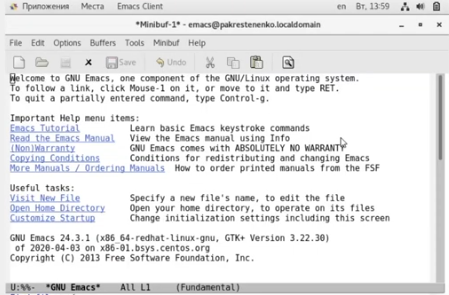
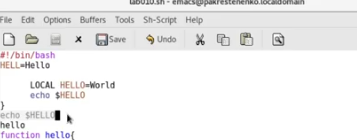

---
## Front matter
lang: ru-RU
title: Отчет по лабораторной работе номер 10
author: |
	Крестененко Полина\inst{1}
	
institute: |
	\inst{1}RUDN University, Moscow, Russian Federation
	
date: 14 мая, 2021, Москва, Россия

## Formatting
toc: false
slide_level: 2
theme: metropolis
header-includes: 
 - \metroset{progressbar=frametitle,sectionpage=progressbar,numbering=fraction}
 - '\makeatletter'
 - '\beamer@ignorenonframefalse'
 - '\makeatother'
aspectratio: 43
section-titles: true
---

## Прагматика выполнения лабораторной работы

Я выполнила лабораторную работу, чтобы получить необходимые знания про работу с редактором Emacs (рис. -@fig:02)

{ #fig:02 width=70% }

## Целью является:

Познакомиться с операционной системой Linux. Получить практические навыки работы с редактором Emacs.

## Задачи:

Среди задач находится выполнить все необходимые действия лабораторной работы, оформить отчеты в нужных форматах и записать скринкасты выполнения работы. Изучение всех теоретических материалов к лабораторной работе номер 10 и приминение их на практике. Среди новых материалов: общие сведения о текстовом редакторе,умение работать с файлом и многое другое.(рис. -@fig:005)

{ #fig:005 width=70% }

## Задачи

(рис. -@fig:007)

{ #fig:007 width=70% }

## Среди результатов:
 
 Я выполнила все указания к лабораторной работе. Оформила отчеты в нужных форматах. Приобрела практические навыки работы с текстовым редактором.

## Вывод 

В ходе выполнения данной лабораторной работы я познакомилась с операционной системой Linuxи получила практические навыки работы с редактором Emacs.

