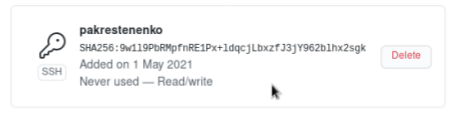

---
# Front matter
lang: ru-RU
title: "Шаблон отчёта по лабораторной работе номер 2 "
subtitle: "Дисциплина: Операционные системы"
author: "Крестененко Полина Александровна"

# Formatting
toc-title: "Содержание"
toc: true # Table of contents
toc_depth: 2
lof: true # List of figures
lot: true # List of tables
fontsize: 12pt
linestretch: 1.5
papersize: a4paper
documentclass: scrreprt
polyglossia-lang: russian
polyglossia-otherlangs: english
mainfont: PT Serif
romanfont: PT Serif
sansfont: PT Sans
monofont: PT Mono
mainfontoptions: Ligatures=TeX
romanfontoptions: Ligatures=TeX
sansfontoptions: Ligatures=TeX,Scale=MatchLowercase
monofontoptions: Scale=MatchLowercase
indent: true
pdf-engine: lualatex
header-includes:
  - \linepenalty=10 # the penalty added to the badness of each line within a paragraph (no associated penalty node) Increasing the value makes tex try to have fewer lines in the paragraph.
  - \interlinepenalty=0 # value of the penalty (node) added after each line of a paragraph.
  - \hyphenpenalty=50 # the penalty for line breaking at an automatically inserted hyphen
  - \exhyphenpenalty=50 # the penalty for line breaking at an explicit hyphen
  - \binoppenalty=700 # the penalty for breaking a line at a binary operator
  - \relpenalty=500 # the penalty for breaking a line at a relation
  - \clubpenalty=150 # extra penalty for breaking after first line of a paragraph
  - \widowpenalty=150 # extra penalty for breaking before last line of a paragraph
  - \displaywidowpenalty=50 # extra penalty for breaking before last line before a display math
  - \brokenpenalty=100 # extra penalty for page breaking after a hyphenated line
  - \predisplaypenalty=10000 # penalty for breaking before a display
  - \postdisplaypenalty=0 # penalty for breaking after a display
  - \floatingpenalty = 20000 # penalty for splitting an insertion (can only be split footnote in standard LaTeX)
  - \raggedbottom # or \flushbottom
  - \usepackage{float} # keep figures where there are in the text
  - \floatplacement{figure}{H} # keep figures where there are in the text
---

# Цель работы

Изучить идеологию и применение средств контроля версий.

# Задание

Написать отчет по 2 лабораторной работе в формате Makefile. Сохранить отчет в трех разных форматах.

# Выполнение лабораторной работы

1) Настройка git
• Создаю учетную запись на https://github.com. (рис. -@fig:001)

{ #fig:001 width=70% }

• Настраиваю систему контроля версий git. Синхранизирую учётную
запись github с компьютером:
git config --global user.name "Имя Фамилия"
git config --global user.email "work@mail" (рис. -@fig:002)

{ #fig:002 width=70% }

• Создаю новый ключ на github (команда ssh-keygen -C "pakrestenenko
<1032201711@pfur.ru>") и привязываю его к копьютеру через
консоль.(рис. -@fig:003)

{ #fig:003 width=70% }

(рис. -@fig:004)

{ #fig:004 width=70% }

(рис. -@fig:005)

{ #fig:005 width=70% }

1) Подключение репозитория к github
• В githup захожу в «repositories» и создаю новый репозиторий (имя
«laborat2», заголовок для файла README). Копируем в консоль
ссылку на репозиторий.(рис. -@fig:006)

{ #fig:006 width=70% }

• Работаю с каталогом и папками через консоль. Перед тем, как
создавать файлы, захожу в репозиорий:(рис. -@fig:007)

{ #fig:007 width=70% }

Создаю файлы:(рис. -@fig:008)

{ #fig:008 width=70% }

• Добавляю первый коммит и выкладываю на githup. Для того, чтобыправильно разместить первый коммит, необходимо добавить
команду git add . , далее с помощью команды git commit -m "first
commit" выкладываем коммит:(рис. -@fig:009)

{ #fig:009 width=70% }

• Сохраняю первый коммит (git push):(рис. -@fig:010)

{ #fig:010 width=70% }

2) Первичная конфигурация
• Добавляю файл лицензии:(рис. -@fig:011)

{ #fig:011 width=70% }

• Добавляю шаблон игнорируемых файлов. Получаю список
имеющихся шаблонов (на скрине представлены не все шаблоны)(рис. -@fig:012)

{ #fig:012 width=70% }

• Скачиваю шаблон, например, для C. Также добавляю новые файлы
и выполняю коммит:(рис. -@fig:013)

{ #fig:013 width=70% }

• Отправляю на github (git push):(рис. -@fig:014)

{ #fig:014 width=70% }

3) Конфигурация git-flow
• Инициализирую git-flow, используя команду git flow init -f (префикс
для ярлыков установлен в v):(рис. -@fig:015)

{ #fig:015 width=70% }

• Проверяю, что нахожусь на ветке develop (git branch):(рис. -@fig:016)

{ #fig:016 width=70% }

• Создаю релиз с версией 1.0.0:(рис. -@fig:017)

{ #fig:017 width=70% }

• 4. Записываю версию и добавляю в индекс:
echo"1.0.0" >> VERSION
git add .
git commit -am 'chore(main): add version'(рис. -@fig:018)

{ #fig:018 width=70% }

• Заливаю релизную ветку в основную ветку (команда git flow release
finish1.0.0):(рис. -@fig:019)

{ #fig:019 width=70% }

• Отправляю данные на github:
git push - -all
git push - -tags(рис. -@fig:020)

{ #fig:020 width=70% }

• Создаю релиз на github. Заходим в «Releases», нажимаю «Создать
новый релиз». Захожу в теги и заполняю все поля (теги для версии
1.0.0). После создания тега, автоматически сформируется релиз.(рис. -@fig:021)

{ #fig:021 width=70% }

Контрольные вопросы:
1.Система контроля версий Git представляет собой набор программ
командной строки. Доступ к ним можно получить из терминала
посредством ввода команды git с различными опциями. Системы контроля
версий (Version Control System, VCS) применяются при работе нескольких
человек над одним проектом.
2. В классических системах контроля версий используется централизованная
модель, предполагающая наличие единого репозитория для хранения
файлов. Выполнение большинства функций по управлению версиями
осуществляется специальным сервером. Участник проекта (пользователь)
перед началом работы посредством определённых команд получает
нужную ему версию файлов. После внесения изменений новую версию в
хранилище. При этом предыдущие версии не удаляются из центрального
хранилища и к ним можно вернуться в любой момент. Сервер может
сохранять неполную версию изменённых файлов, а производить так
называемую дельта-компрессию—сохранять только изменения между
последовательными версиями,что позволяет уменьшить объём хранимых
данных.
Системы контроля версий также могут обеспечивать дополнительные,
более гибкие функциональные возможности. Например,они могут
поддерживать работу с несколькими версиями одного файла,сохраняя
общую историю изменений до точки ветвления версий и собственные
истории изменений каждой ветви. Кроме того, обычно доступна
информация о том, кто из участников, когда и какие изменения вносил.
Обычно такого рода информация хранится в журнале изменений, доступ к
которому можно ограничить.
3. Централизованные системы — это системы, которые используют
архитектуру клиент / сервер, где один или несколько клиентских узлов
напрямую подключены к центральному серверу. Пример - Wikipedia.
В децентрализованных системах каждый узел принимает свое собственное
решение. Конечное поведение системы является совокупностью решений
отдельных узлов. Пример — Bitcoin.
В классических системах контроля версий используется централизованная
модель, предполагающая наличие единого репозитория для хранения
файлов. Выполнение большинства функций по управлению версиями
осуществляется специальным сервером.
4. Создадим локальный репозиторий. Сначала сделаем предварительную
конфигурацию, указав имя и email владельца репозитория:git config --global user.name"Имя Фамилия" git config --global
user.email"work@mail"
и настроив utf-8 в выводе сообщений git: git config --global quotepath false
Для инициализации локального репозитория, расположенного, например, в
каталоге ~/tutorial, необходимо ввести в командной строке:
cd
mkdir tutorial
cd tutorial
git init
5. Для последующей идентификации пользователя на сервере репозиториев
необходимо сгенерировать пару ключей (приватный и открытый):
ssh-keygen -C"Имя Фамилия <work@mail>"
Ключи сохраняться в каталоге~/.ssh/.
Скопировав из локальной консоли ключ в буфер обмена
cat ~/.ssh/id_rsa.pub | xclip -sel clip
вставляем ключ в появившееся на сайте поле.
6. У Git две основных задачи: первая — хранить информацию о всех
изменениях в вашем коде, начиная с самой первой строчки, а вторая —
обеспечение удобства командной работы над кодом.
7. Основные команды git:
o создание основного дерева репозитория: git init
o получение обновлений (изменений)текущего дерева из центрального
репозитория: git pull
o отправка всех произведённых изменений локального дерева в
центральный репозиторий: git push
o просмотр списка изменённых файлов в текущей директории: git status
o просмотр текущих изменения: git diff
o добавить все изменённые и/или созданные файлы и/или каталоги: git add .
o добавить конкретные изменённые и/или созданные файлы и/или
каталоги: git add «имена_файлов»
o удалить файл и/или каталог из индекса репозитория (при этом файл и/или
каталог остаётся в локальной директории): git rm имена_файлов
o сохранить все добавленные изменения и все изменённые файлы: git
commit -am 'Описание коммита'o сохранить добавленные изменения с внесением комментария через встроенный редактор: git commit
o создание новой ветки, базирующейся натекущей: git checkout -b
имя_ветки o переключение на некоторую ветку: git checkout имя_ветки (при
переключении на ветку, которой ещё нет в локальном репозитории, она
будет создана и связана с удалённой)
o отправка изменений конкретной ветки в центральный репозиторий: git
push origin имя_ветки
o слияние ветки стекущим деревом: git merge --no-ff имя_ветки
o удаление локальной уже слитой с основным деревом ветки: git branch -d
имя_ветки
o принудительное удаление локальной ветки: git branch -D имя_ветки
o удаление ветки с центрального репозитория: git push origin :имя_ветки
8. Использования git при работе с локальными репозиториями (добавления
текстового документа в локальный репозиторий):
git add hello.txt
git commit -am ‘Новый файл’
9. нужно постоянно создавать архивы с рабочим кодом
сложно "переключаться" между архивами
сложно перетаскивать изменения между архивами
легко что-то напутать или потерять
10. Во время работы над проектом так или иначе могут создаваться файлы,
которые не требуется добавлять в последствии в репозиторий. Например,
временные файлы, создаваемые редакторами,или объектные файлы,
создаваемые компиляторами. Можно прописать шаблоны игнорируемых
при добавлении в репозиторий типов файлов в файл.gitignore с помощью
сервисов. Для этого сначала нужно получить список имеющихся шаблонов:
curl -L -s https://www.gitignore.io/api/list
Затем скачать шаблон,например, для C и C++
curl -L -s https://www.gitignore.io/api/c >> .gitignore
curl -L -s https://www.gitignore.io/api/c++ >> .gitignore

# Выводы

В ходе выполнения лабораторной работы я изучила идеологию и применение
средств контроля версий
