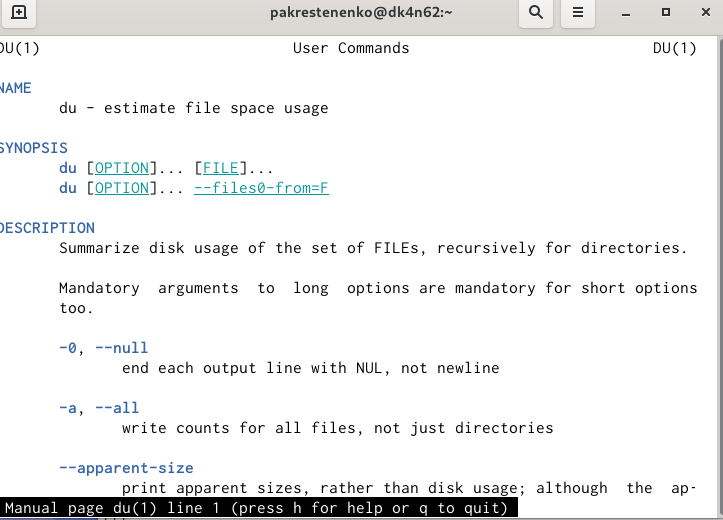

---
# Front matter
lang: ru-RU
title: "Шаблон отчёта по лабораторной работе номер 7"
subtitle: "Дисциплина: Операционные системы"
author: "Крестененко Полины Александровны"

# Formatting
toc-title: "Содержание"
toc: true # Table of contents
toc_depth: 2
lof: true # List of figures
lot: true # List of tables
fontsize: 12pt
linestretch: 1.5
papersize: a4paper
documentclass: scrreprt
polyglossia-lang: russian
polyglossia-otherlangs: english
mainfont: PT Serif
romanfont: PT Serif
sansfont: PT Sans
monofont: PT Mono
mainfontoptions: Ligatures=TeX
romanfontoptions: Ligatures=TeX
sansfontoptions: Ligatures=TeX,Scale=MatchLowercase
monofontoptions: Scale=MatchLowercase
indent: true
pdf-engine: lualatex
header-includes:
  - \linepenalty=10 # the penalty added to the badness of each line within a paragraph (no associated penalty node) Increasing the value makes tex try to have fewer lines in the paragraph.
  - \interlinepenalty=0 # value of the penalty (node) added after each line of a paragraph.
  - \hyphenpenalty=50 # the penalty for line breaking at an automatically inserted hyphen
  - \exhyphenpenalty=50 # the penalty for line breaking at an explicit hyphen
  - \binoppenalty=700 # the penalty for breaking a line at a binary operator
  - \relpenalty=500 # the penalty for breaking a line at a relation
  - \clubpenalty=150 # extra penalty for breaking after first line of a paragraph
  - \widowpenalty=150 # extra penalty for breaking before last line of a paragraph
  - \displaywidowpenalty=50 # extra penalty for breaking before last line before a display math
  - \brokenpenalty=100 # extra penalty for page breaking after a hyphenated line
  - \predisplaypenalty=10000 # penalty for breaking before a display
  - \postdisplaypenalty=0 # penalty for breaking after a display
  - \floatingpenalty = 20000 # penalty for splitting an insertion (can only be split footnote in standard LaTeX)
  - \raggedbottom # or \flushbottom
  - \usepackage{float} # keep figures where there are in the text
  - \floatplacement{figure}{H} # keep figures where there are in the text
---

# Цель работы

Ознакомление  с  инструментами  поиска  файлов  и фильтрации текстовых данных. Приобретение практических навыков: по управлению процессами (и заданиями), по проверке использования диска и обслуживанию файловых систем.

# Задание

Заданием является пункты "Последовательность выполнения работы" файла, размещенного на ТУИС

# Выполнение лабораторной работы

1)Осуществляю вход в систему, используя свои логин и пароль.

2)Для того, чтобы записатьв файл file.txt названия файлов, содержащихся в каталоге /etc, использую команду «ls–a/etc> file.txt».Далее с помощью команды «ls-a~ >> file.txt» дописываюв этот же файл названия файлов, содержащихся в моемдомашнемкаталоге.Командой «catfile.txt» просматриваю  файл,  чтобы  убедиться  в  правильности действий (Рисунок 1).(рис. -@fig:001)

{ #fig:001 width=70% }

3)Вывожу имена всех файлов из file.txt, имеющих расширение .conf и записываюих в новый текстовой файл conf.txt с помощью команды «grep-e‘\.conf$’file.txt> conf.txt». Командой «catconf.txt»проверяю правильность выполненных действий (Рисунок 2).(рис. -@fig:002)

{ #fig:002 width=70% }

4)Определить, какие файлы в моем домашнем каталоге имеют имена, начинающиеся c символа c, можно несколькими командами: «find~ -maxdepth1 -name“c*” -print»(опция maxdepth1 необходима для того, чтобы  файлы  находились  только  в  домашнем  каталоге(не  в  его подкаталогах)),«ls~/c*»и«ls–a~ | grepc*» (Рисунок 3).(рис. -@fig:003)

{ #fig:003 width=70% }

5)Чтобы вывестина экран (постранично) имена файлов из каталога /etc, начинающиеся  с  символа h, воспользуемся  командой «find/etc–
maxdepth1 –name“h*” | less» (Рисунки 4, 5).(рис. -@fig:004)

{ #fig:004 width=70% }

(рис. -@fig:005)

{ #fig:005 width=70% }

6)Запускаю в фоновом режиме процесс, который будет записывать в файл~/logfileфайлы, имена которых начинаются с log, используя команду «find/ -name“log*” > logfile&»(Рисунок 6).Командой «cat logfile» проверяю  выполненные  действия (Рисунок  7). Далее  удаляюфайл ~/logfileкомандой «rm logfile» (Рисунок 8).(рис. -@fig:006)

{ #fig:006 width=70% }

(рис. -@fig:007)

{ #fig:007 width=70% }

(рис. -@fig:008)

{ #fig:008 width=70% }

7)См. пункт выше.
8)Запускаю  редактор gedit в  фоновом  режиме  командой «gedit&» (Рисунок 9). После этого на экране появляется окно редактора.(рис. -@fig:009)

{ #fig:009 width=70% }

9)Чтобы определить идентификатор процесса gedit, использую команду «ps| grep-i“gedit”» (Рисунок 10).Из рисунка видно, что наш процесс имеет PID17170.Узнать  идентификатор  процесса  можно  также, используя команду «pgrep gedit» или «pidof gedit».(рис. -@fig:010)

{ #fig:010 width=70% }

10)Прочитав информацию о команде kill с помощью команды «man kill», использую её  для  завершения  процесса gedit(команда «kill 4156»)(Рисунки 11, 12, 13).(рис. -@fig:011)

{ #fig:011 width=70% }

(рис. -@fig:012)

{ #fig:012 width=70% }

(рис. -@fig:013)

{ #fig:013 width=70% }

11)C помощью команд «mandf»и «mandu»узнаю информацию по необходимым командам и далее использую их (Рисунки 14, 15, 16, 17, 18).
df–утилита,показывающаясписок всех файловых систем по именам устройств, сообщает их размер, занятое и свободное пространство и точки монтирования.
du–утилита,  предназначеннаядля  вывода  информации  об  объеме дискового  пространства,  занятого  файлами  и  директориями.  Она принимает путь к элементу файловой системы и выводит информацию о  количестве  байт  дискового  пространства  или  блоков  диска, задействованных для его хранения.(рис. -@fig:014)

{ #fig:014 width=70% }

(рис. -@fig:015)

{ #fig:015 width=70% }

(рис. -@fig:016)

{ #fig:016 width=70% }

(рис. -@fig:017)

{ #fig:017 width=70% }

(рис. -@fig:018)

{ #fig:018 width=70% }

12)Вывожу имена  всех  директорий,имеющихся  в моем домашнем каталоге с помощью команды «find~ -typed», предварительно получив информацию с помощью команды «manfind» (Рисунки 19, 20).(рис. -@fig:019)

{ #fig:019 width=70% }

(рис. -@fig:020)

{ #fig:020 width=70% }

Контрольные вопросы:
1)Чтобы узнать, какие файловые системы существуют на жёстком диске моего  компьютера,  использую  команду«df-Th» .  Из рисунка  видно,  что на  моем  компьютере  есть следующие  файловыесистемы: devtmpfs,tmpfs,ext4,iso9660.devtmpfsпозволяет ядру создать экземпляр tmpfs с именем devtmpfs при  инициализации  ядра,  прежде  чем  регистрируется  какое-либо устройство  с  драйверами.  Каждое  устройство  с  майором  / минором будет предоставлять узел устройства в devtmpfs.devtmpfs монтируется на /dev и содержит специальные файлы устройств для всех устройств.tmpfs−временное  файловое  хранилище  во  многих  Unix-подобных ОС.  Предназначена  для  монтирования  файловой  системы,  но размещаетсяв ОЗУ вместо ПЗУ. Подобная конструкция является RAM диском.  Данная  файловая  система  также  предназначенная  для быстрого и ненадёжного хранения временных данных.Хорошо  подходит  для  /tmp  и  массовой  сборки  пакетов/образов.Предполагает наличие достаточного объёма виртуальной памяти.Файловая системаtmpfsпредназначенадля того, чтобы использовать 
часть  физической  памяти  сервера  как  обычный  дисковый  раздел,  в котором можно сохранять данные (чтение и запись). Поскольку данные размещены в памяти, то чтение или запись происходят во много раз быстрее, чем с обычного HDD диска.ext4− имеет обратную совместимость с предыдущими версиями ФС. Эта  версия  была  выпущена  в  2008  году.  Является  первой  ФС  из «семейства»Ext,   использующая   механизм   «extentfile     system», который  позволяет  добиться  меньшей  фрагментации  файлов  и увеличить общую производительностьфайловой системы. Кроме того, вExt4реализован  механизм  отложенной  записи  (delayed  allocation  −delalloc), который так же уменьшает фрагментацию диска и снижает нагрузку на CPU. С другой стороны, хотя механизм отложенной записи и используется во многих ФС, но в силу сложности своей реализации он повышает вероятность утери данных.Характеристики:
максимальный размер файла: 16 TB;
максимальный размер раздела: 16TB;
максимальный размер имени файла: 255 символов.Рекомендации по использованию:
наилучший выбор дляSSD;
наилучшая  производительность  по сравнению  с  предыдущимиEtx-системами;
она так же отлично подходит в качестве файловой системы для серверов баз данных, хотя сама система и моложеExt3.
ISO  9660−стандарт, выпущенный Международной организацией по стандартизации,  описывающий  файловую  систему  для  дисков  CD-ROM.  Также  известен  как  CDFS  (Compact  Disc  File  System).  Целью стандарта является обеспечить совместимость носителей под разными операционными системами, такими, как Unix, Mac OS, Windows

2)Файловая   система   Linux/UNIXфизически   представляет   собой пространство  раздела  диска  разбитое  на  блоки  фиксированного размера, кратные размеру сектора − 1024, 2048, 4096 или 8120 байт. Размер блока указывается при создании файловой системы.В файловой структуре Linux имеется один корневой раздел −/ (он же root,  корень).  Все  разделы  жесткого  диска  (если  их  несколько) представляют  собой  структуру  подкаталогов,  "примонтированных"  к определенным каталогам.
/ − кореньЭто главный каталог в системе Linux. По сути, это и есть файловая система  Linux.Адреса  всех  файлов  начинаются  с  корня,  а дополнительные   разделы,   флешки   или   оптические   диски подключаются в папки корневого каталога.
Только пользователь root имеет право читать и изменять файлы в этом каталоге.
/BIN –бинарные файлы пользователяЭтот  каталог  содержит  исполняемые  файлы.  Здесь  расположены программы,  которые  можно  использовать  в  однопользовательском режиме или режиме восстановления. 
/SBIN –системные испольняемые файлыТак же как и /bin, содержит двоичные исполняемые файлы, которые доступны на ранних этапах загрузки, когда не примонтирован каталог /usr. Но здесь находятся программы, которые можно выполнять только с правами суперпользователя. 
/ETC –конфигурационные файлыВ  этой  папке  содержатся  конфигурационные  файлы  всех  программ, установленных в системе.Кроме  конфигурационных  файлов,  в  системе  инициализации  Init Scripts,  здесь  находятся  скрипты  запуска  и  завершения  системных демонов, монтирования файловых систем и автозагрузки программ. 
/DEV –файлы устройствВ  Linux  все,  в  том  числе  внешние  устройства  являются  файлами. Таким образом, все подключенные флешки, клавиатуры, микрофоны, камеры −это  просто  файлы  в  каталоге  /dev/.  Выполняется сканирование  всех  подключенных  устройств  и  создание  для  них специальных файлов. 
/PROC –информация о процессахПо  сути,  это  псевдофайловая  система,  содержащая  подробную информацию  о  каждом  процессе,  его  Pid,  имя  исполняемого  файла, параметры запуска, доступ к оперативной памяти и так далее. Также здесь  можно  найти  информацию  об  использовании  системных ресурсов. 
/VAR–переменные файлы
Название  каталога  /var  говорит  само  за  себя,  он  должен  содержать файлы,  которые  часто  изменяются.  Размер  этих  файлов  постоянно увеличивается.  Здесь  содержатся  файлы  системных  журналов, различные кеши, базы данных и так далее. 
/TMP–временные файлыВ этом каталоге содержатся временные файлы, созданные системой, любыми программами или пользователями. Все пользователи имеют право записи в эту директорию.
/USR –программы пользователяЭто самый большой каталог с большим количеством функций. Здесь находятся  исполняемые  файлы,  исходники  программ,  различные ресурсы приложений, картинки, музыку и документацию.
/HOME –домашняя папкаВ этой папке хранятся домашние каталоги всех пользователей. В них они могут хранить свои личные файлы, настройки программ и т.д. 
/BOOT –файлы загрузчикаСодержит  все  файлы,связанные  с  загрузчиком системы.  Это  ядро vmlinuz, образ initrd, а также файлы загрузчика, находящие в каталоге /boot/grub.
/LIB –системные библиотекиСодержит  файлы  системных  библиотек,  которые  используются исполняемыми файлами в каталогах /bin и /sbin.
/OPT–дополнительные программыВ  эту  папку  устанавливаются  проприетарные  программы,  игры  или драйвера. Это программы созданные в виде отдельных исполняемых файлов самими производителями. 
/MNT –монтирование В  этот  каталог  системные  администраторы  могут  монтировать внешние или дополнительные файловые системы.
/MEDIA –съемные носители 
В  этот  каталог  система  монтирует  все  подключаемые  внешние накопители –USB  флешки,  оптические  диски  и  другие  носители информации.
/SRV –сервер В этом каталоге содержатся файлы серверов и сервисов. 
/RUN -процессыКаталог,содержащий PID файлы процессов, похожий на /var/run, но в отличие от него, он размещен в TMPFS, а поэтому после перезагрузки все файлы теряются
3)Чтобы  содержимое  некоторой  файловойсистемы  было  доступно операционной системе необходимо воспользоваться командой mount.
4)Целостность файловой системы может быть нарушена из-за перебоевв питании,     неполадокв     оборудовании     или     из-за некорректного/внезапноговыключения компьютера.Чтобы устранить повреждения  файловой  системы  необходимо  использовать  команду fsck.
5)Файловую систему можно создать, используя командуmkfs. Ее краткое описание дано в пункте 5) в ходе выполнения заданий лабораторной работы.
6)Для просмотра текстовых файлов существуют следующие команды:
сatЗадача команды cat очень проста −она читает данные из файла или стандартного ввода и выводит их на экран. Синтаксис утилиты:cat  файл1 файл2 ...Основные опции:-b–нумеровать только непустые строки-E–показыватьсимвол $ в конце каждой строки-n–нумеровать все строки-s–удалять пустые повторяющиеся строки
-T– отображать табуляции в виде ^I-h–отобразить справку-v–версия утилиты
nl Командаnlдействует  аналогично  командеcat,  новыводит  еще иномера строк встолбце слева.
less Cущественно более развитая командадля пролистывания текста. При  чтении  данных  со  стандартного  ввода  она  создает  буфер, который позволяет листать текст как вперед, так и назад, а также искать  как  по  направлению  к  концу,  так  и  по  направлению  к началу текста.Синтаксис аналогичный синтаксисукоманды cat.Некоторые опции:-g –при поиске подсвечивать только текущее найденное слово (по умолчанию подсвечиваются все вхождения)-N –показывать номера строк
head Команда head выводит начальные строки (по умолчанию − 10) из одного или нескольких документов. Также она может показывать данные, которые передает на вывод другая утилита.Синтаксис аналогичный синтаксису команды cat.Основные опции:-c (--bytes) −позволяет задавать количество текста не в строках, а в байтах-n  (--lines) −показывает  заданное  количество  строк  вместо  10, которые выводятся по умолчанию-q  (--quiet, --silent) −выводит только текст, недобавляя к нему название файла-v (--verbose) −перед текстом выводит название файла
-z   (--zero-terminated) −символы  перехода  на  новую  строку заменяет символами завершения строк
tail
Эта  командапозволяет  выводить  заданное  количество  строк  с конца файла, а также выводить новые строки в интерактивном режиме.Синтаксис аналогичный синтаксису команды cat.Основные опции:-c −выводить указанное количество байт с конца файла-f −обновлять информацию по мере появления новых строк в файле-n −выводить указанное количество строк из конца файла--pid −используется  с  опцией -f,  позволяет  завершить  работу утилиты, когда завершится указанный процесс-q −не выводить имена файлов--retry− повторять попытки открыть файл, если он недоступен-v −выводить подробную информацию о файле
7)Утилита cpпозволяет полностью копировать файлы и директории.Cинтаксис:cp файл-источник файл-приемникПосле   выполнения   команды   файл-источник   будет   полностью перенесен  в  файл-приемник.  Если  в  конце  указан  слэш,  файл  будет записан в заданную директорию с оригинальным именем.Основные опции:--attributes-only −не  копировать  содержимое  файла,  а  только  флаги доступа и владельца-f, --force −перезаписывать существующие файлы-i, --interactive −спрашивать, нужно ли перезаписывать существующие файлы-L −копировать не символические ссылки, а то, на что они указывают
-n −не перезаписывать существующие файлы-P −не следовать символическим ссылкам-r −копировать папку Linux рекурсивно-s −не  выполнять  копирование  файлов  в  Linux,  асоздавать символические ссылки-u −скопировать файл, только если он был изменён-x −не выходить за пределы этой файловой системы-p −сохранять  владельца,  временные  метки и  флаги  доступа  при копировании-t −считать файл-приемник директорией и копировать файл-источник в эту директорию
8)Командаmvиспользуется  для  перемещения  одного  или  нескольких файлов  (или  директорий)  вдругую  директорию,  атакже  для переименования файлов идиректорий.Синтаксис:mv  старый_файл новый_файлОсновные опции:--help −выводит на экран официальную документацию об утилите--version −отображает версию mv-b−создает  копию  файлов,  которые  были  перемещены  или перезаписаны-f −при  активации  не  будет  спрашивать  разрешение  у  владельца файла, если речь идет о перемещении или переименовании файла-i −наоборот, будет спрашивать разрешение у владельца-n −отключает перезапись уже существующих объектов--strip-trailing-slashes —удаляет  завершающий  символ  /  у  файла  при его наличии-t  —перемещает все файлы в указанную директорию-u −осуществляет перемещение только в том случае, если исходный файл новее объекта назначения
-v −отображает  сведения  о  каждом  элементе  во  время  обработки командыКоманда renameтакже предназначена, чтобы переименовать файл.Синтаксис:rename  старое_имя новое_имя файлыОсновные опции:-v −вывести список обработанных файлов-n −тестовый режим, на самом деле никакие действия выполнены не будут-f −принудительно перезаписывать существующие файлы
9)Права доступа− совокупность правил, регламентирующих порядок и условия  доступа  субъекта  к  объектам  информационной  системы (информации,  её  носителям,  процессам  и  другим  ресурсам) установленных   правовыми   документами   или   собственником, владельцем информации.Права   доступа   к   файлу   или   каталогу   можно   изменить, воспользовавшись командой chmod. Сделать это может владелец файла (или каталога) или пользователь с правами администратора.Синтаксискоманды:chmod режим имя_файлаРежим имеет следующие компоненты структуры и способзаписи:= установить право-лишить права+ датьправоr чтениеw записьx выполнениеu (user) владелец файлаg (group) группа, к которой принадлежит владелец файлаo (others) все остальные.

# Выводы

В  ходе  выполнения  данной  лабораторной  работы  я  изучила инструментыпоиска файлови фильтрации текстовых данных, а также приобрела  практические  навыки:  по  управлению  процессами  (и заданиями), по проверке использования диска и обслуживанию файловых систем.
