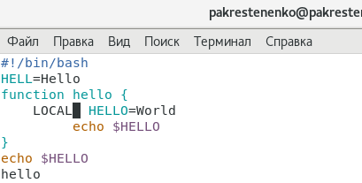
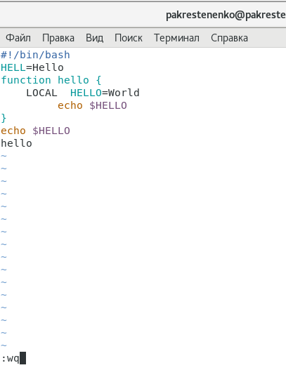

---
## Front matter
lang: ru-RU
title: Отчет по лабораторной работе номер 9
author: |
	Крестененко Полина\inst{1}
	
institute: |
	\inst{1}RUDN University, Moscow, Russian Federation
	
date: 12 мая, 2021, Москва, Россия

## Formatting
toc: false
slide_level: 2
theme: metropolis
header-includes: 
 - \metroset{progressbar=frametitle,sectionpage=progressbar,numbering=fraction}
 - '\makeatletter'
 - '\beamer@ignorenonframefalse'
 - '\makeatother'
aspectratio: 43
section-titles: true
---

## Прагматика выполнения лабораторной работы

Я выполнила лабораторную работу, чтобы получить необходимые знания о работе с редактором vi.(рис. -@fig:003)

{ #fig:003 width=70% }

## Выполнение работы:

Выполнить два задания, представленные в тескте файла лабораторной работы.

## Среди результатов:
 
 Я выполнила все указания к лабораторной работе. Оформила отчеты в нужных форматах. Приобрела практические навыки работы в графическом редакторе vi. Научилась создавать файл в редакторе (рис. -@fig:003)

{ #fig:003 width=70% }

редактировать текст, рабоатать с режимом ввода и режимом командной строки, выходить из редактора и многое другое. (рис. -@fig:006)

{ #fig:006 width=70% }

## Вывод 

В ходе выполнения данной лабораторной работы я познакомилась
с операционной системой Linux и получила практические навыки работы
с редактором vi.

